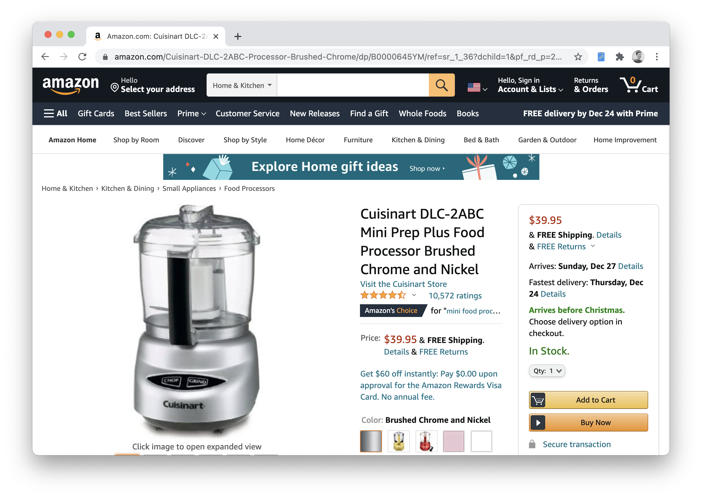
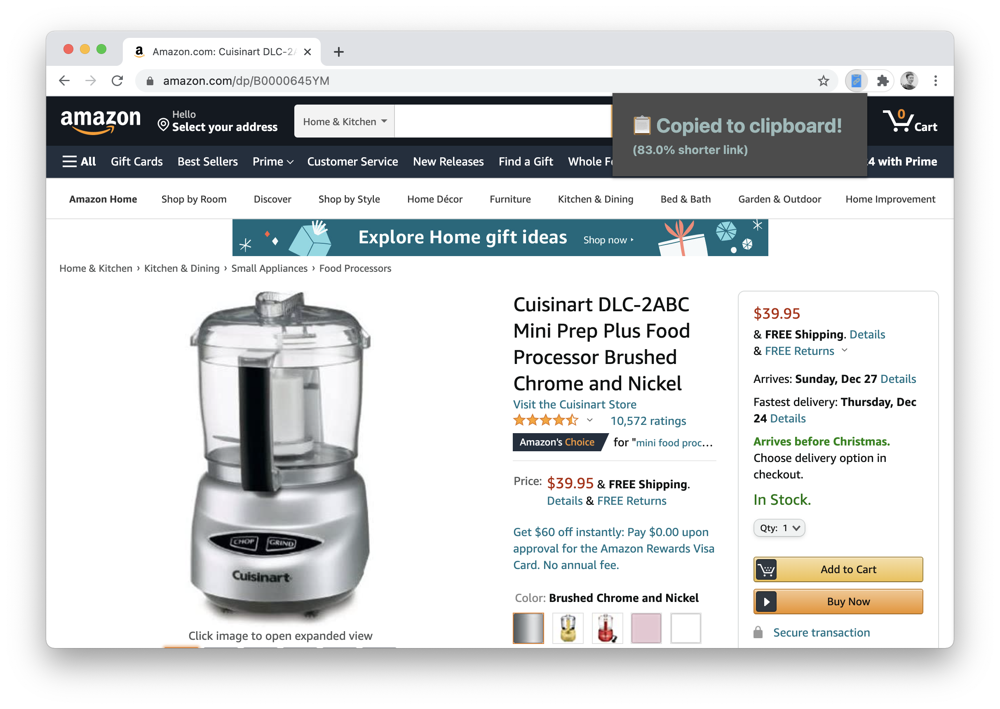

# CleanLink: A Chrome/Edge extension that shortens lengthy links and removes tracking data without the use of a link shortening service.

**Release info**
 <!-- this br tag takes up less vertical space than a new paragraph -->

**Developer info (main branch)**
 <!-- this br tag takes up less vertical space than a new paragraph -->

**Maintenance info**
 <!-- this br tag takes up less vertical space than a new paragraph -->

## User documentation

### How it works

Many websites add a lot of extra "garbage" to the link at the top of your browser, for any of the following reasons:

- Tracking customers throughout the "conversion funnel"
- Making the link more recognizable to humans, such as putting `/Taylor-Swift-Album` in the URL for an album from the best musician to ever live
- Storing extra information about your browsing experience, such as the exact search text that took you to the product you're viewing

However, when copying-and-pasting links to put in emails or spreadsheets, this extra data can take up a lot of space and make the link look... **ugly.**

CleanLink fixes this by taking a link like `https://www.amazon.com/Capri-Sun-Variety-Pack-Strawberry/dp/B0812HZGGZ/?_encoding=UTF8&pd_rd_w=BV32h&pf_rd_p=58f68c27-9bf4-466f-b1c8-101a062bcc82&pf_rd_r=K9PPQDP3APKTHFR13WTA&pd_rd_r=d7a0ba05-e5d9-4c59-a37c-b470911fd28d&pd_rd_wg=bPW0M&ref_=pd_gw_wish` and shortening it to `https://www.amazon.com/dp/B0812HZGGZ` just by removing unnecessary parts of the URL—this shortened link is 14% of it's original length!

| Before                                                | After _(83% shorter link)_                          |
| ----------------------------------------------------- | --------------------------------------------------- |
|  |  |

CleanLink works especially well on Amazon and eBay product links, along with Google and Bing searches, but additionally removes "UTM" tracking data from the links of millions of websites worldwide. It sits in the top right corner of Chrome, and its icon turns from gray to blue when it senses that it can make the link on the current page shorter. When you click on the icon, CleanLink shortens the link and copies it to your clipboard for you.

## *"Sounds great... where do I sign?"*

**[⬇️ Download it now!](https://chrome.google.com/webstore/detail/cleanlink/copgnnhedjdobmglcjbeojddbkhoadpg)**

## Developer documentation

### Building

1. Clone repo
2. `npm install`
3. Import the extension into Chrome
	* Go to [_chrome://extensions_](chrome://extensions) in Chrome
	* With the developer mode checkbox ticked, click **Load unpacked extension...** and select the _dest_ folder from this repo
4. Run one of the following options:
	- **Dev:** `npm run dev` or `npm run watch`
	- **Prod:** `npm run prod`
